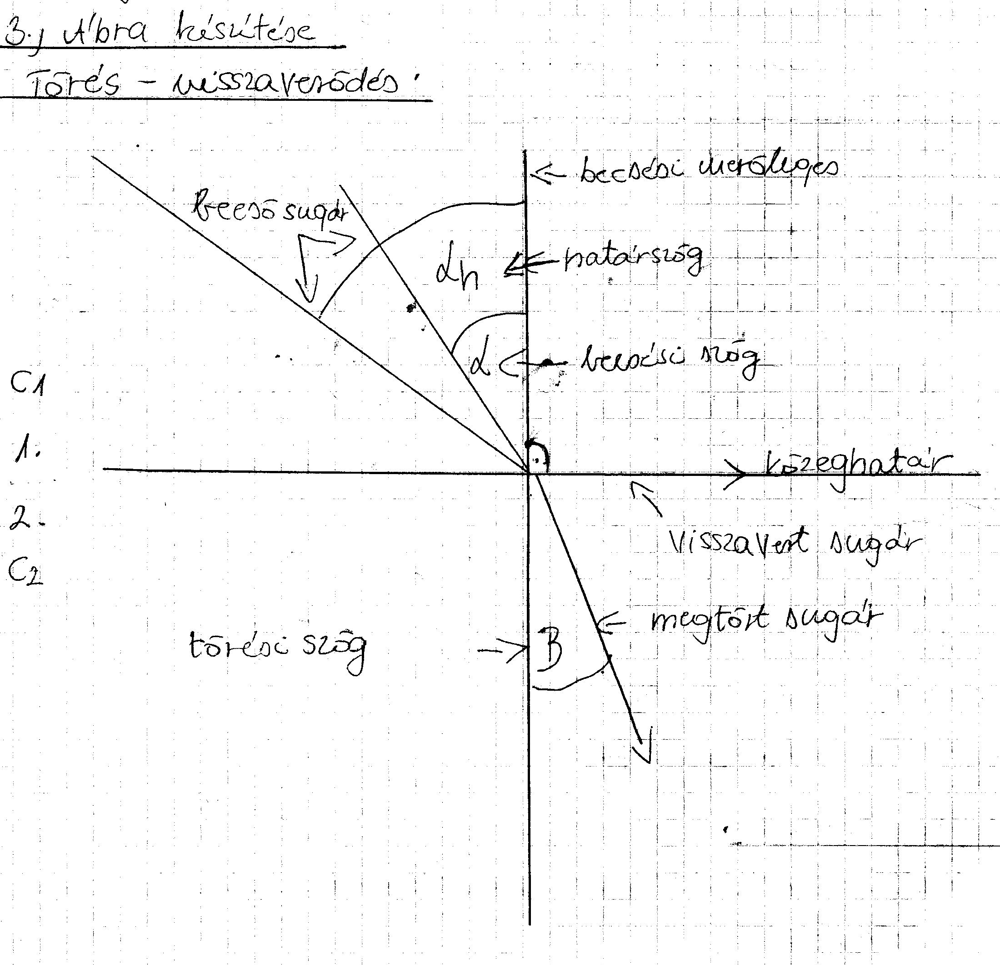

# 1. Fizikai mennyiségek

| Név                | Jel           | M.e.     |
|--------------------|---------------|----------|
| hullámhossz        | λ             | m        |
| frekvencia         | f             | 1/s, Hz  |
| út                 | s             | m        |
| periódusidő        | T             | s        |
| törésmutató        | n             | Ø        |
| beesési szög       | α             | ° (fok)  |
| törési szög        | β             | ° (fok)  |
| terjedési sebesség | c             | m/s      |
| idő                | t             | s        |
| sebesség           | v             | m/s      |
| határszög          | αh | ° (fok)  |

---

# 2. Fogalmak

- **Hullám:** Változás, ami valamilyen közegben terjed.

- **Mechanikai hullám:** Rugalmas közeg egy részén keltett deformáció térbeli és időbeli tovaterjedése.

- **Hullámhossz:** Két legközelebbi azonos fázisban rezgő pont távolsága.

- **Transzverzális hullám:** Olyan hullám, amelyben a közeg részecskéi a rezgésüket az energiaterjedés irányára merőlegesen végzik.

- **Longitudinális hullám:** Olyan hullám, amelyben a közeg részecskéi a rezgésüket az energiaterjedés irányába végzik.

- **Hullámfajték:** Haladóhullám, állóhullám, lökéshullám, longitudinális hullám, transzverzális hullám.

- **Interferencia:** A rezgések összegződnek, szuperponálódnak, ha a hullámok találkozása tartósan megmaradó mintázatot ad.

- **Elhajlás:** Keskeny résen áthaladva a hullám behatol az árnyéktérbe.

- **Huygens–Fresnel elv:** A hullámfelület minden pontja elemi gömbhullámok kiindulópontja és ezek interferenciája adja a későbbi hullámképet. 

- **Hang:** A hallószervünkkel felfogható mechanikai hullám.

---

# 3. Ábra készítése
- **Törés-visszaverődés**

---

# 4. Képletek

- **Sebesség**: v = Δs / t

- **Terjedési sebesség**: c = λ · f = λ / T

- **Törésmutató**: n2,1 = c1 / c2 = sin α / sin β

- **Határszög**: sin αh / sin β = n2,1  ⟹  sin αh = n2,1

- **Teljes visszaverődés feltétele**: sin β = 1

- **Határszög, ahol teljes visszaverődés történik**: β = 90°
